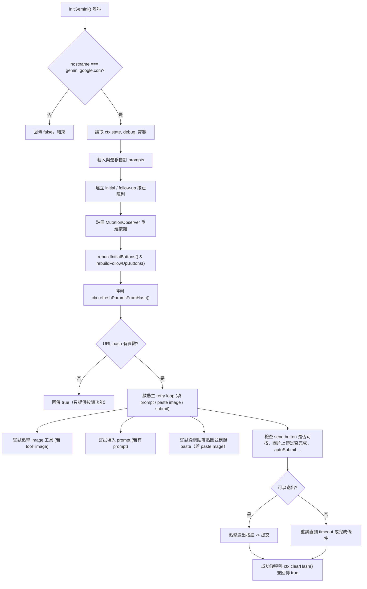

直接回答：下面以中文說明 `src/content/sites/gemini.ts` 的運作方式，先給出一張 mermaid 流程圖做整體導覽，接著分段解釋各功能與流程。我已閱讀並解析程式碼，並畫出流程圖，接下來可以針對某段功能（例如 selector 修正或流程細節）做更深的拆解或改寫。

流程圖（mermaid）：

分段解說（重點與細項）：

1) 入口檢查與回傳
- 函式開頭檢查 host：如果不是 gemini.google.com 就直接 return false（避免走到 Gemini 分支）。
- 若是 Gemini，函式會初始化本檔使用的常數、state、debug，並繼續後續流程。

2) 常數、selector 與輔助工具函數
- GEMINI_EDITOR_SELECTORS / GEMINI_SEND_BUTTON_SELECTORS：列出多個嘗試匹配編輯器與送出按鈕的 CSS 選擇器（因為 DOM 可能變動）。
- getPromptEditor(): 逐一測試 editor 選擇器，找出可用的 editor DOM。
- setGeminiPromptEditor(editorDiv, promptText): 使用 ctx.fillContentEditableWithParagraphs 將內容載入 contentEditable，dispatch input 事件並 focus（與 ChatGPT 的填入方式一致）。
- readClipboardTextSafely(): 嘗試安全讀取剪貼簿文字（有 debug 錯誤處理）。
- isSendButtonEnabled / getSendButton / isSendButtonStopState: 判斷 send button 是否存在、是否可用、或是呈現停止（stop）狀態（根據 aria-label 或 ICON 文字）。

3) 自動提交（autoSubmit）機制
- autoSubmitWhenReady(): 以 retry interval（120ms，最多 20 次）反覆檢查 send button 是否可按、非 stop 狀態、圖片是否上傳完成。滿足條件即 focus 並 click。
- fillPrompt(prompt, autoSubmit): 使用一個 runId 避免交錯，重試尋找 editor，呼叫 setGeminiPromptEditor 填入文字，並在填好後（或嘗試填入後）排程 autoSubmit。

4) 綁定按鈕（bindPromptButton）
- 綁定 initial 或 follow-up 的按鈕事件：pointerdown 與 click。防止短時間內重複觸發（250ms 間隔限定）。
- 若按鈕設定 autoPaste：先讀剪貼簿文字，若 prompt 中有 CLIPBOARD_ARGS_PLACEHOLDER（{{args}}）則將其替換；否則若剪貼簿有內容就把剪貼簿附加到 prompt 後面；最後呼叫 fillPrompt。
- 若未啟 autoPaste：直接呼叫 fillPrompt。

5) 預設/自定 prompts 與 storage migration
- getDefaultReviewPrompt(): 回傳一個預設的「評論」prompt（用於首填列表）。
- loadCustomPromptsFromExtensionStorageWithMigration(): 先嘗試從 chrome.storage.local 讀取 key（CUSTOM_PROMPTS_KEY）。若為陣列就確保有預設 prompt（migrate），否則嘗試讀 localStorage（legacy），並將 legacy 寫入 chrome.storage（migration）。
- safeParseJsonArray(): 忍錯 JSON.parse，僅在為陣列時回傳。

6) 建按鈕的邏輯（initial / follow-up）
- buildInitialButtonsFromPrompts / buildFollowUpButtonsFromPrompts: 根據 prompts 物件的 enabled / initial 屬性來分成初始按鈕與後續按鈕（ReadyPrompt[]）。
- rebuildInitialButtons(): 找到 zero-state（空白畫面）或近似區塊，插入或更新 id='custom-gemini-initial-buttons' 的橫列按鈕，並為每個按鈕呼叫 bindPromptButton。
  - getInitialButtonsZeroStateRoot() 與 getInitialButtonsMountTarget()：用一套規則尋找最適合 mount 初始按鈕的 DOM 節點（考慮 modular-zero-state, bot-info-card 等）。
- rebuildFollowUpButtons(): 當最後一個 assistant response 出現時，在該 response 後面插入 id='custom-gemini-followup-buttons' 的按鈕列（若處於 zero state 或 send button 為 stop 或沒有 send button，會移除按鈕）。

7) 監聽 chrome.storage 變更
- 若 chrome.storage.onChanged 可用，當 CUSTOM_PROMPTS_KEY 在 local 區域變更時，重新建立 initial 與 follow-up 列表（並移除舊 DOM）。

8) MutationObserver
- 註冊一個 MutationObserver（監測 body 的 childList/attributes/subtree），用去抖（timer）在 DOM 變動後呼叫 rebuildInitialButtons 與 rebuildFollowUpButtons（確保按鈕隨畫面更新/切換正確顯示）。

9) URL hash 參數處理與自動執行（prompt / pasteImage / autoSubmit）
- ctx.refreshParamsFromHash(); 之後以 state 是否有 prompt、tool、pasteImage、autoSubmit 決定是否進入自動流程。
- 主要變數：
  - toolImageClicked, promptFilled, pastingGeminiImage, geminiImagePasteAttempted, submitted（追蹤流程狀態與防止重複）。
- getComposerRoot(): 根據 send button 或 editor 找到 composer 的根節點（用來檢查上傳偵測或 attachment）。
- hasUploadInProgress / hasImageAttachment / isImageUploadComplete(): 用來判斷圖片是否已上傳完成（避免過早送出）。
- tryClickImageToolButton(): 如果 state.tool === 'image'，遍歷所有按鈕找 textContent 包含「生成圖片」或 "create image" 的按鈕並 click（只點一次）。
- 主 retry loop（ctx.startRetryInterval）：
  - interval 500ms，retries 根據是否要 pasteImage 多寡（若 pasteImage，多給時間）。
  - 每次 tick：
    - 嘗試點 image 工具按鈕（若 tool=image）。
    - 若 textarea 與 state.prompt 且還沒填則 setGeminiPromptEditor 填入（promptFilled = true）。
    - 若需要 pasteImage 且還沒嘗試，會呼叫 ctx.fetchClipboardImageAndSimulatePaste(textarea) 來抓取剪貼簿圖片並模擬 paste 行為（中間有延遲）。
    - 檢查能否送出（按鈕可用、非 stop、prompt 已填、state.autoSubmit、未提交、圖片上傳完成、tool image 狀態滿足）。
    - 若可以送出，點擊送出按鈕並標記 submitted，並在送出後清除 URL hash（ctx.clearHash）。
    - 當所有需求都達成（或超時），回傳 done -> 結束 retry loop。

10) 回傳值
- 如果進入 Gemini 分支即會最終 return true（表示已處理此站點）；早期若 hostname mismatch 回 false。

注意事項與邊界條件
- 選取器是脆弱的：程式使用多個候選 selector 與重試機制（retry intervals / MutationObserver）來容錯 DOM 變動，但仍可能失效（需開發者在新版介面更新時調整 selector）。
- 剪貼簿與圖片貼上受瀏覽器安全/授權限制：pasteImage 需要 Clipboard API、secure context 與 user gesture 的支援，可能在某些環境失敗。
- 按鈕觸發時的 clipboard placeholder 支援 `{{args}}`，可把剪貼簿文字插入預設 prompt 的位置。
- chrome.storage 遷移：如果使用 localStorage 舊值，程式會嘗試搬移到 chrome.storage 並確保 put 進預設 prompt（確保使用者有「評論」預設）。

我已完成解析與流程圖。如果你想，我可以：
- 依照流程圖再產生更細的 sequence diagram（顯示 event ordering），或
- 幫你修正/強化某些 selector，或
- 把主要流程抽成測試清單（例如每個 retry 條件需要檢查的 DOM）。
